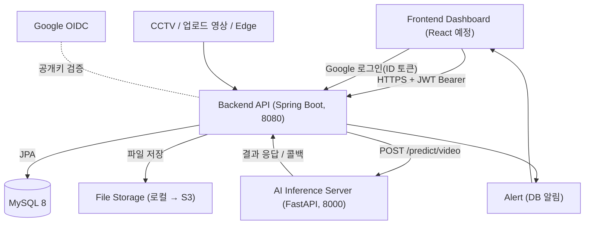
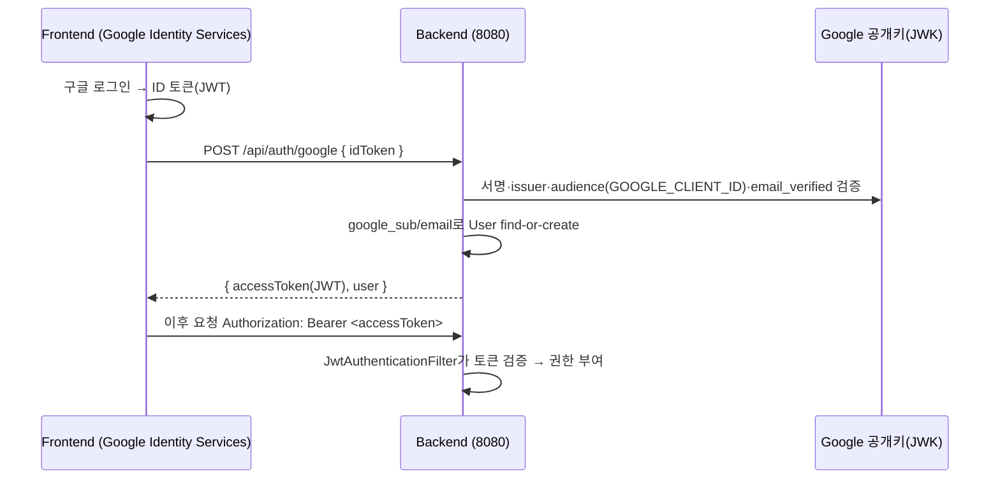
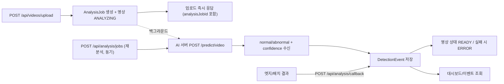
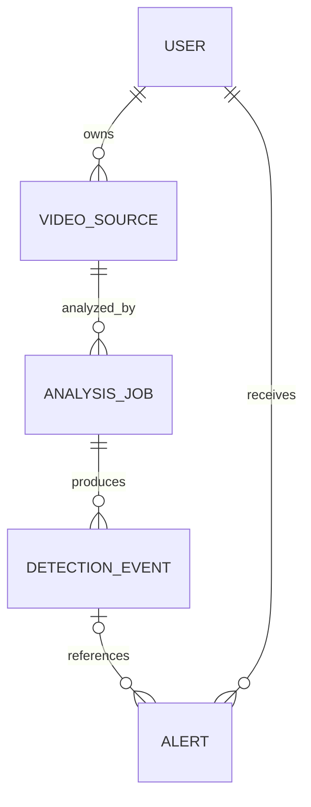

# APAP 시스템 구조 (Architecture)

비정상 행동 알람 플랫폼의 시스템 구조 문서입니다. 백엔드 구현 기준으로 작성되었으며, 프론트엔드/AI 서버 연동 지점을 함께 기술합니다.

## 전체 구성



## 구성 요소

| 구성 | 기술 | 포트 | 담당 |
|---|---|---|---|
| Frontend | React 등 | (예: 5173) | 프론트팀 |
| Backend API | Spring Boot 3.3 / Java 17 | 8080 | 백엔드팀 |
| AI Inference | FastAPI / Python | 8000 | AI팀 |
| DB | MySQL 8 (Docker) | 3306(로컬은 3307 노출) | 백엔드팀 |
| File Storage | local/s3 모드 분기 (`apap.storage.mode`) | - | 백엔드팀 |

### 영상 저장소 (local / s3 모드)

7월 회의 결정에 따라 영상 업로드를 S3로 전환하되, 로컬 개발을 위해 모드를 분기한다 (`StorageService` 인터페이스 + 구현체 2종).

| | local (기본) | s3 (운영) |
|---|---|---|
| 저장 위치 | `uploads/videos/{uuid}-{filename}` | S3 `project10-86-virg-apap-media` (us-east-1) |
| `sourceUrl` 값 | 로컬 파일 경로 | **S3 객체 키** `videos/{uuid}-{filename}` (풀 URL 아님) |
| 자격증명 | 불필요 | EC2 인스턴스 프로파일 Role (액세스 키 발급 불가 계정) |
| AI 접근 | 같은 머신/공유 볼륨 경로 | AI 서버가 키로 S3 직접 접근 (학습 시 목록 순회 포함) |

- 키 형식은 `videos/{uuid}-{filename}` 고정. **라벨/케이스 등 분류 정보는 키에 인코딩하지 않고 DB 컬럼으로만 관리한다** (AI 학습 데이터 구조와 서비스 데이터 구조 분리).
- 전환 환경변수: `APP_STORAGE_MODE=s3`, `S3_BUCKET`, `AWS_REGION`(계정 정책상 us-east-1 고정).
- 로컬에서는 이 계정의 정책상 S3 접근이 불가능하므로, S3 경로는 **EC2 배포 후에만 실검증** 가능(테스트는 mock 기반).

## 인증 흐름 (구글 OIDC + JWT)

이메일/비밀번호 방식을 제거하고 구글 로그인 단일화. 백엔드는 OIDC ID 토큰을 검증한 뒤 자체 JWT를 발급한다.



- JWT: HS256, subject=userId, 클레임 email/name/role, 기본 만료 24h.
- 권한: ADMIN/MANAGER/VIEWER. 조회=VIEWER+, 쓰기=MANAGER+.

## 분석 파이프라인



### 업로드 시 자동 분석

7월 회의 이후 요구사항: **분석 버튼을 누르지 않고 영상만 올려도 분석이 시작된다.**

- `POST /api/videos/upload` → VideoSource 저장 → AnalysisJob 생성(영상 상태 `ANALYZING`) → **응답 즉시 반환**
- AI 호출은 영상 길이만큼 걸리므로 전용 스레드풀(`analysisExecutor`)에서 백그라운드 실행한다. 업로드 응답을 막지 않는다.
- 클라이언트는 응답의 `analysisJobId`로 `GET /api/analysis/jobs/{jobId}`를 폴링해 진행 상황을 본다.
- 완료 시 영상 상태를 `READY`(실패 `ERROR`)로 정리한다.
- 백그라운드 스레드는 요청 세션 밖이라 `AnalysisJob`을 조회할 때 `videoSource`/`user`를 **join fetch로 함께 로딩**한다(LAZY 접근 실패 방지).
- 수동/자동 경로가 `AnalysisService` 하나를 공유하므로 AI 호출·이벤트 저장 로직이 중복되지 않는다.
- `apap.analysis.auto-on-upload=false`로 끌 수 있고, 자동 분석은 `UPLOAD` 타입에만 적용된다(URL로 등록한 CCTV 등은 제외).

- 재분석은 **동기 호출**(`POST /api/analysis/jobs`). 실패 시 AnalysisJob `FAILED`.
- 보조 흐름은 **콜백**(엣지/AI가 결과 배열을 직접 전송). FALL/INTRUSION 등 확장 타입 수용.
- AI에 전달하는 `video_path`는 `VideoSource.sourceUrl` 값 그대로다. local 모드에선 파일 경로(동일 머신/공유 볼륨 필요), s3 모드에선 S3 객체 키(AI 서버가 버킷에서 직접 다운로드, AI 측도 S3 읽기 권한 필요).

### 실시간 감지 알림 흐름

업로드 영상의 배치 분석과 달리, 실시간 스트림은 **AI 서버가 알림 여부까지 판단해서 백엔드에 통보**한다.

```text
카메라(RTSP) → AI 서버 실시간 추론
   → 5연속 감지 + 재발동 쿨다운으로 "지금 알릴지" 판정(should_notify)
   → 알릴 때만 POST /api/alerts/live { videoSourceId, message? }
백엔드 → videoSourceId로 카메라 소유자를 찾아 Alert 생성
   → 프론트 알림 페이지가 폴링으로 표시
```

- **중복 억제는 AI 쪽 책임**이다. 매 프레임 알림이 쌓이지 않도록 AI가 이벤트당 한 번만 호출한다.
- 문구는 요청의 `message` → 수신자의 활성 케이스 `out_msg` → 기본 문구 순으로 결정된다(7월 회의 결정을 실시간 경로에서 유지).
- 배치 분석 경로(업로드/콜백)는 **알림을 만들지 않는다.** 영상을 저장할 때마다 알림이 쌓이는 문제 때문에 분리했다.
- 공개 경로라 현재는 누구나 호출할 수 있다 → `analysis/callback`과 함께 API Key 보호가 후속 과제.

## 백엔드 내부 구조 (패키지)

```text
com.apap.backend
  auth/        # 구글 OIDC 검증(GoogleTokenVerifier), JWT(JwtTokenProvider), 인증 필터, AuthController
  user/        # User(google_sub, role), UserRepository
  video/       # VideoSource(soft delete), VideoController
  storage/     # StorageService(local/s3 분기), LocalStorageService, S3StorageService, S3StorageConfig
  analysis/    # AnalysisJob, AnalysisService(AI 호출·자동 분석), AnalysisController(요청/콜백)
  event/       # DetectionEvent, EventController
  alert/       # Alert, AlertController
  dashboard/   # 요약/타임라인/심각도 통계
  config/      # SecurityConfig(필터체인/CORS), OpenApiConfig(Swagger Bearer), AsyncConfig(자동 분석 스레드풀)
  common/      # ApiResponse, ApiError, BaseEntity(created/updated/deleted), GlobalExceptionHandler
  health/      # 헬스체크
```

## 데이터 모델 (요약)



- 모든 엔티티는 `created_at`, `updated_at`, `deleted`(soft delete 플래그) 보유.
- `VideoSource`는 soft delete 적용(`@SQLRestriction`), 삭제 시 `deleted=true`.
- **`AnalysisJob` / `DetectionEvent` / `Alert`에도 `@SQLRestriction("deleted = false")` 적용**(리셋 기능 도입 시 추가). 숨긴 데이터가 목록·상세·대시보드 집계에서 자동으로 빠진다.

### 리셋(숨김) 동작

"저장된 영상 리셋"과 "알림 리셋"은 데이터를 지우지 않고 화면에서만 감춘다.

| 구분 | API | 숨기는 대상 | 건드리지 않는 것 |
|---|---|---|---|
| 영상 리셋 | `POST /api/videos/reset` | 내 영상 + 그 영상의 분석 작업·감지 이벤트 | 알림, S3/로컬 파일 |
| 알림 리셋 | `POST /api/alerts/reset` | 내 알림 전부(읽음 무관) | 영상, 이벤트 |

- 두 리셋은 **서로 독립**이다. 화면이 "저장된 영상"과 "알림 내역"으로 나뉘어 있어 각각 비울 수 있어야 하기 때문.
- 벌크 숨김은 네이티브 `UPDATE ... SET deleted = true`로 처리한다. `@SQLRestriction`은 조회에만 적용되고 벌크 UPDATE에는 적용되지 않기 때문.
- 영상 리셋 시 **딸린 데이터를 먼저 숨기고 영상을 나중에 숨긴다.** 영상을 먼저 숨기면 하위 조회 조건(`video_sources`)에서 걸러져 함께 처리되지 않는다.
- 데이터가 남아 있으므로 필요 시 DB에서 `deleted = false`로 되돌려 복구할 수 있다.
- `Alert.detection_event_id`는 nullable(테스트/시스템 알림).

## 보안 / 공개 경로

- 공개: `/api/health`, `/api/auth/google`, `POST /api/analysis/callback`, `POST /api/alerts/live`(AI 서버 전용), Swagger, 정적 페이지(`/`, `/google-login.html`).
- 그 외 전부 인증 필요. 401=`UNAUTHORIZED`, 403=`FORBIDDEN` (통일 에러 포맷).
- CORS 허용 origin: `http://localhost:3000`, `http://localhost:5173` (프론트 도메인 추가 시 `SecurityConfig` 수정).

## 배포 구성

- 로컬: `docker-compose.yml`로 MySQL(Docker) + 백엔드. 백엔드는 IntelliJ 또는 컨테이너 실행.
- 운영(목표): 백엔드 Docker 이미지(EC2/ECS 등) + 관리형 MySQL(RDS). 비밀값은 환경변수/시크릿으로 주입.
- 스키마: 개발은 `ddl-auto: update`, 운영은 `validate` + 마이그레이션 도구(Flyway 등) 권장.

## 케이스 등록 흐름 (7월 회의 반영)

```text
[시드] 감지 케이스 4종(한강 교각/식당 식권/영화관 입장/마트 은닉) 자동 등록
사용자 → POST /api/user-cases (케이스 구독, out_msg 응답)
AI 판정 ABNORMAL → DetectionEvent 저장
  현재는 알림 내역으로 Alert를 자동 생성하지 않음
로그인 시 login_history에 (user_id, 로그인 시각) 자동 기록
```

## ⚠️ 기술스택 확인 필요 (팀 확정 요청)

- 7월 회의록에는 BE가 `fastapi`, RDB가 `미정(postgres 추천)`으로 표기되어 있으나, **현 구현은 Spring Boot 3.3 + MySQL 8로 dev에 병합·동작·테스트 완료 상태**다.
- AGENTS 규칙에 따라 임의 재작성하지 않았으며, 팀이 fastapi/postgres로 확정할 경우 **별도 마이그레이션 과제로 분리**해 진행한다.

## 변경 이력
- (7월 회의 반영) **로그인 이력**(`login_history`) 기록/조회, **감지 케이스 도메인**(`detection_cases`, `user_cases`) + 시드 4종 + 알림 out_msg 연계, AI 계약(Anomaly Detection 후에도 동일) 확인
- 인증: 이메일/비밀번호 → **구글 OIDC + JWT + Spring Security** 로 전환
- 도메인: **scenario 제거**, AI 연동을 실제 `/predict/video`(normal/abnormal) 스펙에 맞춤
- 추가: `/auth/me`, `/auth/logout`, video 상세/수정/삭제, dashboard timeline/severity, alerts/test
- 품질: soft delete, 통일 에러 포맷, 통합 테스트
- 저장소: 영상 업로드 **S3 전환** — `storage/` 패키지 신설, local/s3 모드 분기, 키 형식 `videos/{uuid}-{filename}`, EC2 Role 자격증명 (7월 회의)
