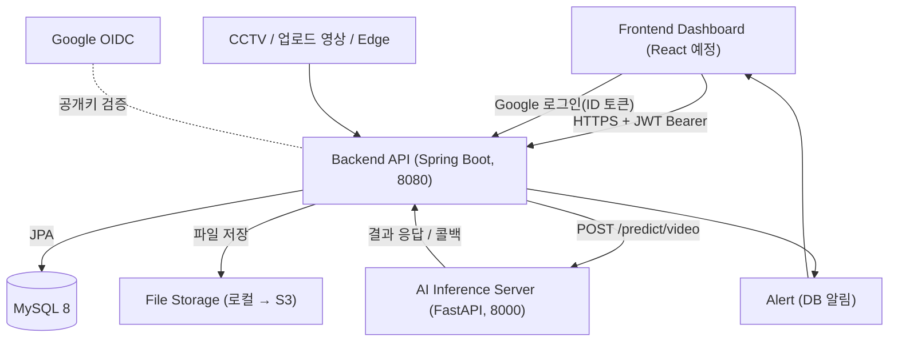
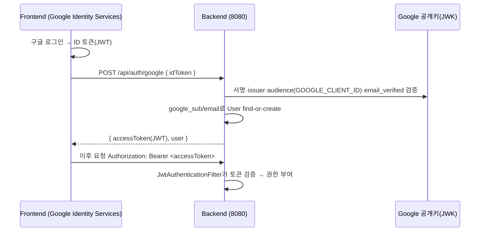
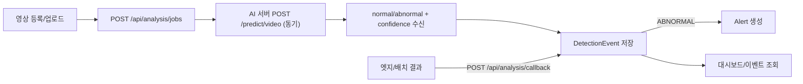

# APAP 시스템 구조 (Architecture)

비정상 행동 알람 플랫폼의 시스템 구조 문서입니다. 백엔드 구현 기준으로 작성되었으며, 프론트엔드/AI 서버 연동 지점을 함께 기술합니다.

## 전체 구성



## 구성 요소

| 구성 | 기술 | 포트 | 담당 |
|---|---|---|---|
| Frontend | React 등 | (예: 5173) | 프론트팀 |
| Backend API | Spring Boot 3.3 / Java 17 | 8080 | 백엔드팀 |
| AI Inference | FastAPI / Python | 8000 | AI팀 |
| DB | MySQL 8 (Docker) | 3306(로컬은 3307 노출) | 백엔드팀 |
| File Storage | 로컬 `uploads/` → S3 | - | 백엔드팀 |

## 인증 흐름 (구글 OIDC + JWT)

이메일/비밀번호 방식을 제거하고 구글 로그인 단일화. 백엔드는 OIDC ID 토큰을 검증한 뒤 자체 JWT를 발급한다.



- JWT: HS256, subject=userId, 클레임 email/name/role, 기본 만료 24h.
- 권한: ADMIN/MANAGER/VIEWER. 조회=VIEWER+, 쓰기=MANAGER+.

## 분석 파이프라인



- 기본 흐름은 **동기 호출**(요청 시 AI를 바로 부르고 결과 저장). 실패 시 AnalysisJob `FAILED`.
- 보조 흐름은 **콜백**(엣지/AI가 결과 배열을 직접 전송). FALL/INTRUSION 등 확장 타입 수용.
- ⚠️ AI에 전달하는 `video_path`는 백엔드 파일 경로이므로, **AI 서버가 동일 파일에 접근 가능**해야 한다(공유 볼륨/스토리지/URL 합의 필요).

## 백엔드 내부 구조 (패키지)

```text
com.apap.backend
  auth/        # 구글 OIDC 검증(GoogleTokenVerifier), JWT(JwtTokenProvider), 인증 필터, AuthController
  user/        # User(google_sub, role), UserRepository
  video/       # VideoSource(soft delete), VideoController
  analysis/    # AnalysisJob, AnalysisController(AI 호출/콜백)
  event/       # DetectionEvent, EventController
  alert/       # Alert, AlertController
  dashboard/   # 요약/타임라인/심각도 통계
  config/      # SecurityConfig(필터체인/CORS), OpenApiConfig(Swagger Bearer)
  common/      # ApiResponse, ApiError, BaseEntity(created/updated/deleted), GlobalExceptionHandler
  health/      # 헬스체크
```

## 데이터 모델 (요약)


- 모든 엔티티는 `created_at`, `updated_at`, `deleted`(soft delete 플래그) 보유.
- `VideoSource`는 soft delete 적용(`@SQLRestriction`), 삭제 시 `deleted=true`.
- `Alert.detection_event_id`는 nullable(테스트/시스템 알림).

## 보안 / 공개 경로

- 공개: `/api/health`, `/api/auth/google`, `POST /api/analysis/callback`, Swagger, 정적 페이지(`/`, `/google-login.html`).
- 그 외 전부 인증 필요. 401=`UNAUTHORIZED`, 403=`FORBIDDEN` (통일 에러 포맷).
- CORS 허용 origin: `http://localhost:3000`, `http://localhost:5173` (프론트 도메인 추가 시 `SecurityConfig` 수정).

## 배포 구성

- 로컬: `docker-compose.yml`로 MySQL(Docker) + 백엔드. 백엔드는 IntelliJ 또는 컨테이너 실행.
- 운영(목표): 백엔드 Docker 이미지(EC2/ECS 등) + 관리형 MySQL(RDS). 비밀값은 환경변수/시크릿으로 주입.
- 스키마: 개발은 `ddl-auto: update`, 운영은 `validate` + 마이그레이션 도구(Flyway 등) 권장.

## 케이스 기반 알림 흐름 (7월 회의 반영)

```text
[시드] 감지 케이스 4종(한강 교각/식당 식권/영화관 입장/마트 은닉) 자동 등록
사용자 → POST /api/user-cases (케이스 구독, out_msg 응답)
AI 판정 ABNORMAL → DetectionEvent 저장 → Alert 생성 시
  유저의 활성 케이스가 있으면 그 케이스의 out_msg를 알림 메시지로 사용
  (없으면 기본 메시지 유지)
로그인 시 login_history에 (user_id, 로그인 시각) 자동 기록
```

## ⚠️ 기술스택 확인 필요 (팀 확정 요청)

- 7월 회의록에는 BE가 `fastapi`, RDB가 `미정(postgres 추천)`으로 표기되어 있으나, **현 구현은 Spring Boot 3.3 + MySQL 8로 dev에 병합·동작·테스트 완료 상태**다.
- AGENTS 규칙에 따라 임의 재작성하지 않았으며, 팀이 fastapi/postgres로 확정할 경우 **별도 마이그레이션 과제로 분리**해 진행한다.

## 변경 이력
- (7월 회의 반영) **로그인 이력**(`login_history`) 기록/조회, **감지 케이스 도메인**(`detection_cases`, `user_cases`) + 시드 4종 + 알림 out_msg 연계, AI 계약(Anomaly Detection 후에도 동일) 확인
- 인증: 이메일/비밀번호 → **구글 OIDC + JWT + Spring Security** 로 전환
- 도메인: **scenario 제거**, AI 연동을 실제 `/predict/video`(normal/abnormal) 스펙에 맞춤
- 추가: `/auth/me`, `/auth/logout`, video 상세/수정/삭제, dashboard timeline/severity, alerts/test
- 품질: soft delete, 통일 에러 포맷, 통합 테스트
