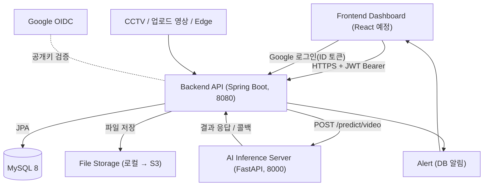
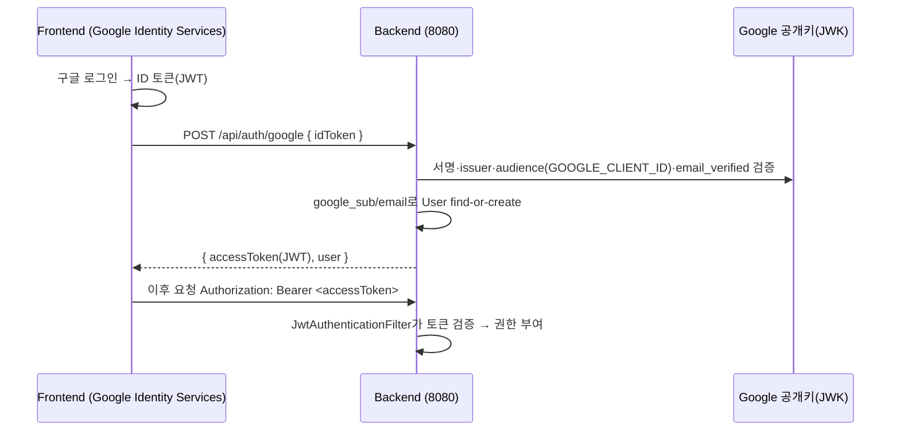
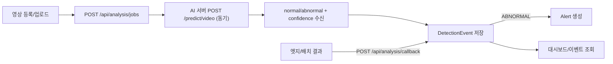

# APAP 시스템 구조 (Architecture)

비정상 행동 알람 플랫폼의 시스템 구조 문서입니다. 백엔드 구현 기준으로 작성되었으며, 프론트엔드/AI 서버 연동 지점을 함께 기술합니다.

## 전체 구성



## 구성 요소

| 구성 | 기술 | 포트 | 담당 |
|---|---|---|---|
| Frontend | React 등 | (예: 5173) | 프론트팀 |
| Backend API | Spring Boot 3.3 / Java 17 | 8080 | 백엔드팀 |
| AI Inference | FastAPI / Python | 8000 | AI팀 |
| DB | MySQL 8 (Docker) | 3306(로컬은 3307 노출) | 백엔드팀 |
| File Storage | local/s3 모드 분기 (`apap.storage.mode`) | - | 백엔드팀 |

### 영상 저장소 (local / s3 모드)

7월 회의 결정에 따라 영상 업로드를 S3로 전환하되, 로컬 개발을 위해 모드를 분기한다 (`StorageService` 인터페이스 + 구현체 2종).

| | local (기본) | s3 (운영) |
|---|---|---|
| 저장 위치 | `uploads/videos/{uuid}-{filename}` | S3 `project10-86-virg-apap-media` (us-east-1) |
| `sourceUrl` 값 | 로컬 파일 경로 | **S3 객체 키** `videos/{uuid}-{filename}` (풀 URL 아님) |
| 자격증명 | 불필요 | EC2 인스턴스 프로파일 Role (액세스 키 발급 불가 계정) |
| AI 접근 | 같은 머신/공유 볼륨 경로 | AI 서버가 키로 S3 직접 접근 (학습 시 목록 순회 포함) |

- 키 형식은 `videos/{uuid}-{filename}` 고정. **라벨/케이스 등 분류 정보는 키에 인코딩하지 않고 DB 컬럼으로만 관리한다** (AI 학습 데이터 구조와 서비스 데이터 구조 분리).
- 전환 환경변수: `APP_STORAGE_MODE=s3`, `S3_BUCKET`, `AWS_REGION`(계정 정책상 us-east-1 고정).
- 로컬에서는 이 계정의 정책상 S3 접근이 불가능하므로, S3 경로는 **EC2 배포 후에만 실검증** 가능(테스트는 mock 기반).

## 인증 흐름 (구글 OIDC + JWT)

이메일/비밀번호 방식을 제거하고 구글 로그인 단일화. 백엔드는 OIDC ID 토큰을 검증한 뒤 자체 JWT를 발급한다.



- JWT: HS256, subject=userId, 클레임 email/name/role, 기본 만료 24h.
- 권한: ADMIN/MANAGER/VIEWER. 조회=VIEWER+, 쓰기=MANAGER+.

## 분석 파이프라인



- 기본 흐름은 **동기 호출**(요청 시 AI를 바로 부르고 결과 저장). 실패 시 AnalysisJob `FAILED`.
- 보조 흐름은 **콜백**(엣지/AI가 결과 배열을 직접 전송). FALL/INTRUSION 등 확장 타입 수용.
- AI에 전달하는 `video_path`는 `VideoSource.sourceUrl` 값 그대로다. local 모드에선 파일 경로(동일 머신/공유 볼륨 필요), s3 모드에선 S3 객체 키(AI 서버가 버킷에서 직접 다운로드, AI 측도 S3 읽기 권한 필요).

## 백엔드 내부 구조 (패키지)

```text
com.apap.backend
  auth/        # 구글 OIDC 검증(GoogleTokenVerifier), JWT(JwtTokenProvider), 인증 필터, AuthController
  user/        # User(google_sub, role), UserRepository
  video/       # VideoSource(soft delete), VideoController
  storage/     # StorageService(local/s3 분기), LocalStorageService, S3StorageService, S3StorageConfig
  analysis/    # AnalysisJob, AnalysisController(AI 호출/콜백)
  event/       # DetectionEvent, EventController
  alert/       # Alert, AlertController
  dashboard/   # 요약/타임라인/심각도 통계
  config/      # SecurityConfig(필터체인/CORS), OpenApiConfig(Swagger Bearer)
  common/      # ApiResponse, ApiError, BaseEntity(created/updated/deleted), GlobalExceptionHandler
  health/      # 헬스체크
```

## 데이터 모델 (요약)


- 모든 엔티티는 `created_at`, `updated_at`, `deleted`(soft delete 플래그) 보유.
- `VideoSource`는 soft delete 적용(`@SQLRestriction`), 삭제 시 `deleted=true`.
- `Alert.detection_event_id`는 nullable(테스트/시스템 알림).

## 보안 / 공개 경로

- 공개: `/api/health`, `/api/auth/google`, `POST /api/analysis/callback`, Swagger, 정적 페이지(`/`, `/google-login.html`).
- 그 외 전부 인증 필요. 401=`UNAUTHORIZED`, 403=`FORBIDDEN` (통일 에러 포맷).
- CORS 허용 origin: `http://localhost:3000`, `http://localhost:5173` (프론트 도메인 추가 시 `SecurityConfig` 수정).

## 배포 구성

- 로컬: `docker-compose.yml`로 MySQL(Docker) + 백엔드. 백엔드는 IntelliJ 또는 컨테이너 실행.
- 운영(목표): 백엔드 Docker 이미지(EC2/ECS 등) + 관리형 MySQL(RDS). 비밀값은 환경변수/시크릿으로 주입.
- 스키마: 개발은 `ddl-auto: update`, 운영은 `validate` + 마이그레이션 도구(Flyway 등) 권장.

## 변경 이력(이번 작업 반영)
- 인증: 이메일/비밀번호 → **구글 OIDC + JWT + Spring Security** 로 전환
- 도메인: **scenario 제거**, AI 연동을 실제 `/predict/video`(normal/abnormal) 스펙에 맞춤
- 추가: `/auth/me`, `/auth/logout`, video 상세/수정/삭제, dashboard timeline/severity, alerts/test
- 품질: soft delete, 통일 에러 포맷, 통합 테스트
- 저장소: 영상 업로드 **S3 전환** — `storage/` 패키지 신설, local/s3 모드 분기, 키 형식 `videos/{uuid}-{filename}`, EC2 Role 자격증명 (7월 회의)
