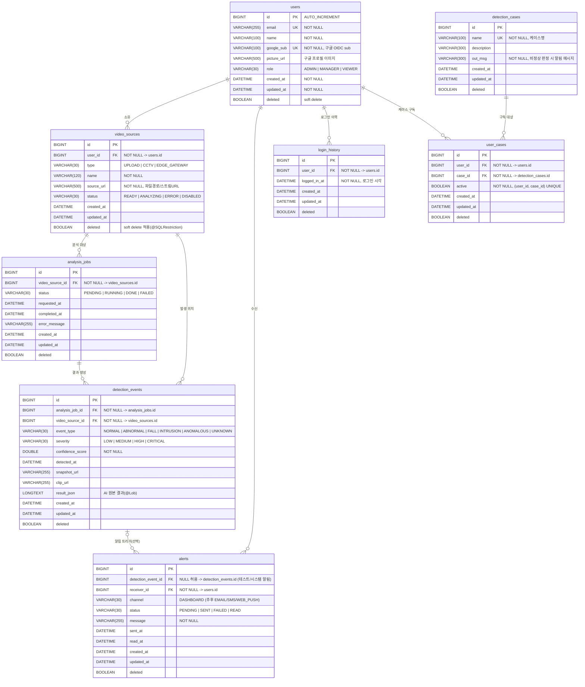

# APAP ERD (Entity-Relationship Diagram)

백엔드 구현(JPA 엔티티) 기준의 데이터 모델입니다. DB: MySQL 8, 테이블은 Hibernate `ddl-auto: update`로 생성됩니다.

## ERD (Mermaid)

> GitHub에서 자동 렌더링됩니다.



## 관계 요약

| 관계 | 카디널리티 | 설명 |
|---|---|---|
| users → video_sources | 1 : N | 사용자가 영상 소스를 소유 |
| video_sources → analysis_jobs | 1 : N | 영상 하나에 여러 분석 작업 |
| analysis_jobs → detection_events | 1 : N | 분석 결과로 이벤트 생성 |
| video_sources → detection_events | 1 : N | 이벤트 발생 영상 (역정규화 참조) |
| detection_events → alerts | 0..1 : N | 이상 이벤트 시 알림 (테스트 알림은 이벤트 없이 생성 가능) |
| users → alerts | 1 : N | 알림 수신자 |
| users → login_history | 1 : N | 구글 로그인 성공 시마다 1건 기록 (7월 회의) |
| users → user_cases ← detection_cases | N : M (매핑 테이블) | 유저의 감지 케이스 구독. 비정상 판정 시 활성 케이스의 `out_msg`를 알림 메시지로 사용 (7월 회의) |

## 설계 노트

- **공통 컬럼**: 모든 테이블에 `created_at`, `updated_at`, `deleted`(soft delete) — `BaseEntity` 상속.
- **소유권 체인**: `users → video_sources → analysis_jobs → detection_events` — 조회 시 이 체인으로 "내 데이터"만 필터링 (예: `findAllByVideoSourceUserId...`).
- **scenario 없음**: 초기 설계의 scenario 도메인은 AI 서버 실제 스펙(normal/abnormal 이진 분류)에 맞춰 제거됨.
- **enum은 문자열 저장**: `@Enumerated(EnumType.STRING)` — DB에서 읽기 쉽고 순서 변경에 안전.
- **alerts.detection_event_id nullable**: 테스트/시스템 알림 지원.
- **video_sources.deleted**: `@SQLDelete`로 삭제 시 UPDATE, `@SQLRestriction`으로 조회 자동 제외.

## dbdiagram.io 용 DBML

> https://dbdiagram.io 에 붙여넣으면 시각 ERD로 렌더링/이미지 내보내기 가능 (보고서용).

```dbml
Table users {
  id bigint [pk, increment]
  email varchar(255) [not null, unique]
  name varchar(100) [not null]
  google_sub varchar(100) [not null, unique, note: '구글 OIDC sub']
  picture_url varchar(500)
  role varchar(30) [not null, note: 'ADMIN | MANAGER | VIEWER']
  created_at datetime [not null]
  updated_at datetime [not null]
  deleted boolean [not null, default: false]
}

Table video_sources {
  id bigint [pk, increment]
  user_id bigint [not null, ref: > users.id]
  type varchar(30) [not null, note: 'UPLOAD | CCTV | EDGE_GATEWAY']
  name varchar(120) [not null]
  source_url varchar(500) [not null]
  status varchar(30) [not null, note: 'READY | ANALYZING | ERROR | DISABLED']
  created_at datetime [not null]
  updated_at datetime [not null]
  deleted boolean [not null, default: false]
}

Table analysis_jobs {
  id bigint [pk, increment]
  video_source_id bigint [not null, ref: > video_sources.id]
  status varchar(30) [not null, note: 'PENDING | RUNNING | DONE | FAILED']
  requested_at datetime
  completed_at datetime
  error_message varchar(255)
  created_at datetime [not null]
  updated_at datetime [not null]
  deleted boolean [not null, default: false]
}

Table detection_events {
  id bigint [pk, increment]
  analysis_job_id bigint [not null, ref: > analysis_jobs.id]
  video_source_id bigint [not null, ref: > video_sources.id]
  event_type varchar(30) [not null, note: 'NORMAL | ABNORMAL | FALL | INTRUSION | ANOMALOUS | UNKNOWN']
  severity varchar(30) [not null, note: 'LOW | MEDIUM | HIGH | CRITICAL']
  confidence_score double [not null]
  detected_at datetime
  snapshot_url varchar(255)
  clip_url varchar(255)
  result_json longtext
  created_at datetime [not null]
  updated_at datetime [not null]
  deleted boolean [not null, default: false]
}

Table alerts {
  id bigint [pk, increment]
  detection_event_id bigint [ref: > detection_events.id, note: 'NULL = 테스트/시스템 알림']
  receiver_id bigint [not null, ref: > users.id]
  channel varchar(30) [not null, default: 'DASHBOARD']
  status varchar(30) [not null, note: 'PENDING | SENT | FAILED | READ']
  message varchar(255) [not null]
  sent_at datetime
  read_at datetime
  created_at datetime [not null]
  updated_at datetime [not null]
  deleted boolean [not null, default: false]
}
```
